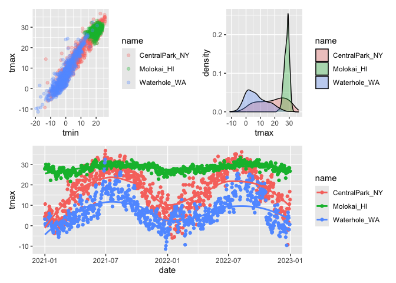

Vis I
================

``` r
weather_df = 
  rnoaa::meteo_pull_monitors(
    c("USW00094728", "USW00022534", "USS0023B17S"),
    var = c("PRCP", "TMIN", "TMAX"), 
    date_min = "2021-01-01",
    date_max = "2022-12-31") |>
  mutate(
    name = case_match(
      id, 
      "USW00094728" ~ "CentralPark_NY", 
      "USW00022534" ~ "Molokai_HI",
      "USS0023B17S" ~ "Waterhole_WA"),
    tmin = tmin / 10,
    tmax = tmax / 10) |>
  select(name, id, everything())
```

    ## using cached file: /Users/shehzrin/Library/Caches/org.R-project.R/R/rnoaa/noaa_ghcnd/USW00094728.dly

    ## date created (size, mb): 2024-09-26 10:19:43.784363 (8.651)

    ## file min/max dates: 1869-01-01 / 2024-09-30

    ## using cached file: /Users/shehzrin/Library/Caches/org.R-project.R/R/rnoaa/noaa_ghcnd/USW00022534.dly

    ## date created (size, mb): 2024-09-26 10:19:57.596087 (3.932)

    ## file min/max dates: 1949-10-01 / 2024-09-30

    ## using cached file: /Users/shehzrin/Library/Caches/org.R-project.R/R/rnoaa/noaa_ghcnd/USS0023B17S.dly

    ## date created (size, mb): 2024-09-26 10:20:08.816672 (1.036)

    ## file min/max dates: 1999-09-01 / 2024-09-30

Make a scatterplot but fancy this time.

``` r
weather_df |>
  ggplot(aes(x = tmin, y = tmax, color = name)) + 
  geom_point(alpha=.3) +
  labs(
    title = "Temperature scatterplot",
    x = "Minimum Temp (C)",
    y = "Maximum Temp (C)",
    color = "Location",
    caption = "Weather data taken from rnoaa package for three stations."
  )
```

    ## Warning: Removed 17 rows containing missing values or values outside the scale range
    ## (`geom_point()`).

<!-- -->

Scales – start with ‘x’ and ‘y’

``` r
weather_df |>
  ggplot(aes(x = tmin, y = tmax, color = name)) + 
  geom_point(alpha=.3) +
  labs(
    title = "Temperature scatterplot",
    x = "Minimum Temp (C)",
    y = "Maximum Temp (C)",
    color = "Location",
    caption = "Weather data taken from rnoaa package for three stations."
  ) + 
  scale_x_continuous(
    breaks = c(-15, 0, 20),
    labels = c("-15C", "0", "20")
  ) + 
  scale_y_continuous(
    limits = c(0,30),
    transform = "sqrt"
  )
```

    ## Warning in transformation$transform(x): NaNs produced

    ## Warning in scale_y_continuous(limits = c(0, 30), transform = "sqrt"): sqrt
    ## transformation introduced infinite values.

    ## Warning: Removed 302 rows containing missing values or values outside the scale range
    ## (`geom_point()`).

<!-- -->

Look at color:

``` r
weather_df |>
  ggplot(aes(x = tmin, y = tmax, color = name)) + 
  geom_point(alpha=.3) +
  labs(
    title = "Temperature scatterplot",
    x = "Minimum Temp (C)",
    y = "Maximum Temp (C)",
    color = "Location",
    caption = "Weather data taken from rnoaa package for three stations."
  ) + 
  scale_color_hue(h = c(100,400)) 
```

    ## Warning: Removed 17 rows containing missing values or values outside the scale range
    ## (`geom_point()`).

<!-- -->

viridis: color scheme that works well with color blindness and black and
white.

``` r
weather_df |>
  ggplot(aes(x = tmin, y = tmax, color = name)) + 
  geom_point(alpha=.3) +
  labs(
    title = "Temperature scatterplot",
    x = "Minimum Temp (C)",
    y = "Maximum Temp (C)",
    color = "Location",
    caption = "Weather data taken from rnoaa package for three stations."
  ) + 
  viridis::scale_color_viridis(discrete = TRUE)
```

    ## Warning: Removed 17 rows containing missing values or values outside the scale range
    ## (`geom_point()`).

<!-- -->

## Themes

``` r
ggp_scatterplot = weather_df |>
  ggplot(aes(x = tmin, y = tmax, color = name)) + 
  geom_point(alpha=.3) +
  labs(
    title = "Temperature scatterplot",
    x = "Minimum Temp (C)",
    y = "Maximum Temp (C)",
    color = "Location",
    caption = "Weather data taken from rnoaa package for three stations."
  ) + 
  viridis::scale_color_viridis(discrete = TRUE)
```

``` r
ggp_scatterplot + 
  theme(legend.position = "bottom")
```

    ## Warning: Removed 17 rows containing missing values or values outside the scale range
    ## (`geom_point()`).

<!-- -->

``` r
ggp_scatterplot + 
  theme_bw() + 
  theme(legend.position = "bottom")
```

    ## Warning: Removed 17 rows containing missing values or values outside the scale range
    ## (`geom_point()`).

<!-- -->

Order matters…

``` r
ggp_scatterplot + 
  theme(legend.position = "bottom") + 
  theme_bw() 
```

    ## Warning: Removed 17 rows containing missing values or values outside the scale range
    ## (`geom_point()`).

<!-- -->

minimal

``` r
ggp_scatterplot + 
  theme_minimal() + 
  theme(legend.position = "bottom")
```

    ## Warning: Removed 17 rows containing missing values or values outside the scale range
    ## (`geom_point()`).

<!-- -->

classic

``` r
ggp_scatterplot + 
  theme_classic() + 
  theme(legend.position = "bottom")
```

    ## Warning: Removed 17 rows containing missing values or values outside the scale range
    ## (`geom_point()`).

<!-- -->

theme excel

``` r
ggp_scatterplot + 
  ggthemes::theme_excel() + 
  theme(legend.position = "bottom")
```

    ## Warning: Removed 17 rows containing missing values or values outside the scale range
    ## (`geom_point()`).

<!-- -->

New scatterplot

``` r
weather_df |>
  ggplot(aes(x = date, y = tmax, color = name)) + 
  geom_point(alpha = 0.3) +
  geom_smooth(se = FALSE) + 
   viridis::scale_color_viridis(discrete = TRUE) + 
  labs(
    title = "Seasonal variation in Max Temp",
    x = "Date",
    y = "Maximum Temp(C)",
    color = "Location",
    size = "Precipitation"
  ) + 
  theme_minimal() + 
  theme(legend.position = "bottom")
```

    ## `geom_smooth()` using method = 'loess' and formula = 'y ~ x'

    ## Warning: Removed 17 rows containing non-finite outside the scale range
    ## (`stat_smooth()`).

    ## Warning: Removed 17 rows containing missing values or values outside the scale range
    ## (`geom_point()`).

<!-- -->

Extra bonus stuff in ‘ggplot’

Use different datasets in different `geom`s

``` r
central_park_df =
  weather_df |>
  filter(name == "CentralPark_NY")

molokai_df = 
  weather_df |>
  filter(name == "Molokai_HI")

molokai_df |>
  ggplot(aes(x = date, y = tmax, color = name)) + 
  geom_point() +
  geom_line(data = central_park_df)
```

    ## Warning: Removed 1 row containing missing values or values outside the scale range
    ## (`geom_point()`).

<!-- -->

## Multiple panels

``` r
weather_df |>
  ggplot(aes(x = tmax, fill = name)) +
  geom_density() +
  facet_grid(.~name)
```

    ## Warning: Removed 17 rows containing non-finite outside the scale range
    ## (`stat_density()`).

<!-- -->

adding patchwork library for

``` r
ggp_tmax_tmin = 
  weather_df |>
  ggplot(aes(x = tmin, y = tmax, color = name)) + 
  geom_point(alpha = 0.3)

ggp_tmax_density = 
  weather_df |>
  ggplot(aes(x = tmax, fill = name)) + 
  geom_density(alpha = 0.3)

ggp_tmax_date = 
  weather_df |>
  ggplot(aes(x = date, y = tmax, color = name)) + 
  geom_point() +
  geom_smooth(se = FALSE)

(ggp_tmax_tmin + ggp_tmax_density) / ggp_tmax_date 
```

    ## Warning: Removed 17 rows containing missing values or values outside the scale range
    ## (`geom_point()`).

    ## Warning: Removed 17 rows containing non-finite outside the scale range
    ## (`stat_density()`).

    ## `geom_smooth()` using method = 'loess' and formula = 'y ~ x'

    ## Warning: Removed 17 rows containing non-finite outside the scale range
    ## (`stat_smooth()`).

    ## Warning: Removed 17 rows containing missing values or values outside the scale range
    ## (`geom_point()`).

<!-- -->
